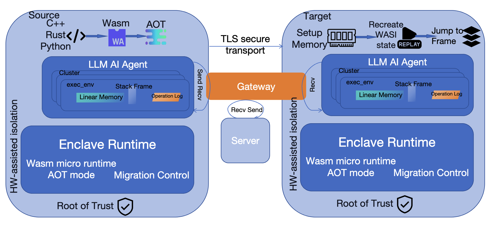
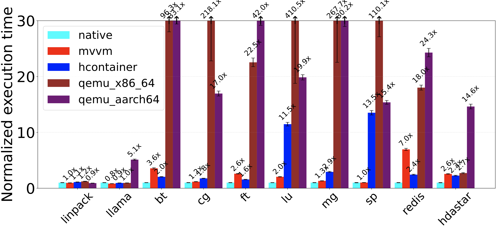

# Migratable Velocity Virtual Machine
[](https://github.com/Multi-V-VM/MVVM/actions/workflows/build-windows.yml)[](https://github.com/Multi-V-VM/MVVM/actions/workflows/build-macos.yml)[](https://github.com/Multi-V-VM/MVVM/actions/workflows/build-ubuntu.yml)[](https://github.com/Multi-V-VM/Multi-V-VM.github.io/actions/workflows/mkdocs.yml)



The rise of AI agents powered by Large Language
Models (LLMs) presents critical challenges: how to securely exe-
cute and migrate these agents across heterogeneous environments
while protecting sensitive user data, maintaining availability
during network failures, minimizing response latency for time-
critical decisions, and ensuring output safety in mission-critical
applications. We present MVVM, a WebAssembly-based secure
container framework that enables transparent live migration
of LLM agent workspaces between edge devices and cloud
servers with end-to-end privacy guarantees, resilient multi-tier
replication, speculative execution for latency optimization, and
integrated validation for safety assurance.
MVVM introduces two key innovations: (1) a two-way sand-
boxing framework leveraging hardware enclaves and accelerator
extensions that protects both the agent from malicious hosts
and the host from compromised agents; (2) an efficient cross-
platform migration mechanism using WebAssembly and WASI’s
platform-agnostic design, enabling seamless movement across
ARM phones, RISC-V MCUs, x86 servers, and heterogeneous
accelerators.

## Just run
```bash
wamrc --opt-level=3 --disable-aux-stack-check --enable-counter-loop-checkpoint -o bc.aot bench/bc.aot
./MVVM_checkpoint -t bench/bc.aot -a -g20,-n1000
./MVVM_restore -t bench/bc.aot
```
Policy for `wamrc`
1. counter loop checkpoint `--enable-counter-loop-checkpoint`
2. loop dirty checkpoint `--enable-loop-dirty-checkpoint`, meaning use the dirty bit to checkpoint
3. `--enable-checkpoint`, enable function level checkpoint
4. `--disable-aux-stack-check`, disable the aux stack check

## To debug mode checkpoint and migrate a WAMR nano process
First comment out the following in `checkpoint.cpp`
```c++
wamr->get_int3_addr();
wamr->replace_int3_with_nop();
wamr->replace_mfence_with_nop();
```
Then
```bash
python3 ../artifact/common_util.py # return $recv is 193
SPDLOG_LEVEL=debug ./MVVM_checkpoint -t test/tcp_client.aot -f 193 -c 0 -x 10 -a "10" -e OMP_NUM_THREADS=1 -i
SPDLOG_LEVEL=debug ./MVVM_restore -t test/tcp_client.aot # All the wasi env will be restored
```
1. -t Target: The path to the WASM interpreter or AOT executable
2. -i Debug Mode: Switch on for debugging
3. -f Function: The function to stop and checkpoint
4. -x Function Counter: The WASM function counter to stop and checkpoint
5. -c Counter: The WASM instruction counter to stop and checkpoint(Conflict with -f and -x)
6. -a Arguments: The arguments to the function
7. -e Environment: The environment variables to the function

## Design Doc
1. All the pointers will be stored as offset to the linear memory.
2. Go forward and never go back, all the calling into WASI land will row back to the call on recovery.
3. Use AOT compiler convention with a stable point to achieve cross-platform.

## Performance


## Use Cases
1. Privacy-aware scheduling that automatically determines whether to execute locally or remotely based on data sensitivity and resource availability;
2. Multi-tier replication with intelligent quality degradation that maintains service availability despite network failures or resource constraints;
3. A comprehensive execution framework combining speculative execution for 10× latency reduction with parallel validation that ensures output safety without compromising responsiveness

## Cite
```
@article{yang2024transparent,
  title={Transparent and Efficient Live Migration across Heterogeneous Hosts with Wharf},
  author={Yang, Yiwei and Hu, Aibo and Zheng, Yusheng and Zhao, Brian and Zhang, Xinqi and Quinn, Andrew},
  journal={arXiv preprint arXiv:2410.15894},
  year={2024}
}
```