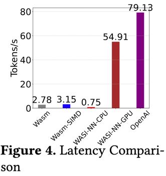
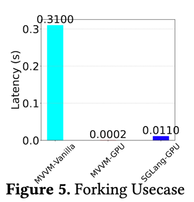

# fork usecase

While OpenAI’s runtime prioritizes maximum throughput within a centralized infrastructure, **MVVM** focuses on flexibility, modularity, and stateful management of LLM workloads. Although its raw throughput may be lower, **MVVM** excels in adaptive, context-aware scenarios, enabling operations such as forking, snapshotting, and rolling back states. This approach is ideal for workflows where users need to revisit earlier reasoning steps, refine code, or explore alternative solutions without restarting from scratch.

**Adaptive, Context-Aware Execution**

When acting as an LLM-based language server, developers often spawn multiple solution paths simultaneously or revert to previous states mid-conversation. **MVVM** seamlessly supports these operations at runtime, facilitating a more interactive and exploratory environment. By allowing quick context switching and state manipulation, **MVVM** supports use cases ranging from iterative code refinement to collaborative experimentation.

**Forking Mechanism and Overhead**

Forking overhead in **MVVM** is remarkably low—about 0.2ms per fork—making it highly efficient for branching predicted computations, particularly when memory has already been pinned. This minimal overhead enables the system to maintain responsive performance even when branching multiple states in parallel.

**Resource Sharing and Isolation**

Common resources, including model weights and static data, are shared in read-only segments to reduce overhead and prevent unnecessary data duplication. Each fork then maintains strict isolation for its own dynamic state and memory. This design ensures that several parallel inference tasks can coexist without compromising performance or introducing security risks.

**Conclusion**

By combining adaptability, low overhead, and robust isolation, **MVVM** offers a powerful substrate for running LLM workloads that demand dynamic interaction, frequent branching, and iterative refinement. Its unique focus on stateful management and efficient forking makes **MVVM** particularly well-suited to complex, evolving workflows where exploration and reusability are paramount.