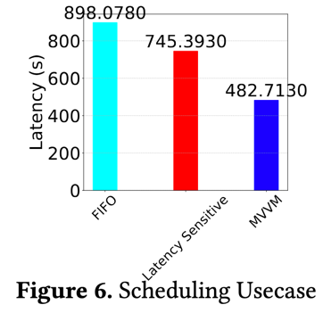
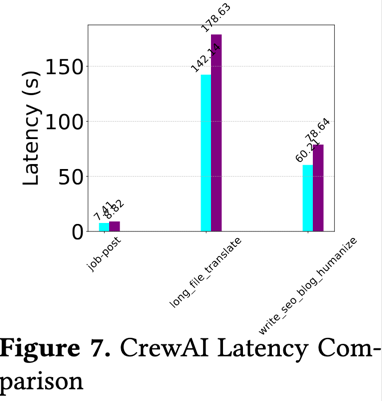

**Overview**

This section describes a scheduling framework for LLM-based workloads, focusing on scenarios that require application-aware resource management. We target workloads such as low-latency interactive requests (for example, chatbots and code completion). In practice, these workloads often coexist in production environments, each with distinct priorities and performance goals.

**Challenges of Conventional Scheduling**

Under traditional first-in-first-out (FIFO) scheduling, latency-sensitive tasks may be delayed by ongoing bulk operations. Alternatively, simple partitioning—where resources are statically isolated for specific job classes—can reduce overall efficiency and waste capacity when workloads fluctuate.

**Dynamic Task Grouping**

By contrast, the described scheduler uses a dynamic approach to identify and group tasks with shared context or similar performance requirements. This grouping maximizes cache locality and avoids redundant computation. It also employs live performance metrics to adaptively allocate resources, ensuring that critical requests—such as multi-agent code generation tasks—receive timely execution without significantly impacting throughput-focused jobs.

**Performance Improvements**

Evaluations center on the latency observed by interactive queries, such as chat and code-completion tasks. Results show that this scheduler can reduce latency by up to 46% compared to a FIFO baseline and by up to 35% compared to a purely latency-sensitive (static partitioning) baseline. These gains demonstrate the framework’s ability to handle varied, real-world LLM workloads while ensuring interactive responsiveness.

**Conclusion**

By unifying resource management with dynamic grouping and continuous performance monitoring, this scheduling framework efficiently supports diverse, evolving LLM tasks. It offers a balanced solution for environments that demand both responsiveness for critical requests and high utilization for throughput-oriented operations.

Multi-Agent Collaboration with crewAI
To evaluate MVVM in a realistic setting, we conducted experiments using a multi-agent LLM application based on the crewAI framework. crewAI enables multiple specialized agents—each handling distinct roles such as planning, coding, reviewing, and summarizing—to collaborate on complex, multi-step tasks. These agents rely on LLM-driven inference pipelines, asynchronous interactions, and dynamic state management, making them ideal candidates for testing MVVM’s capabilities in handling heterogeneous, stateful workloads at scale.

In our experiment, we configured crewAI agents to work cooperatively on a software development project:

Planning Agent: Decomposed the user’s high-level requirements into actionable subtasks.

Code-Generation Agents: Produced implementation snippets based on the subtasks.

Review Agents: Analyzed and refined the generated code.

Documentation Agents: Created explanatory notes and documentation.

Throughout this process, we leveraged MVVM’s ability to:

Fork Agent States at stable checkpoints for parallel development paths.

Migrate Tasks between local and cloud-backed LLM engines based on resource availability and performance goals.

Roll Back to earlier steps when encountering logic flaws or misinterpretations.

These features allowed crewAI to adapt seamlessly when tasks needed to be reassigned or re-evaluated, ensuring efficient use of resources and quick recovery from errors. Compared to a baseline configuration that did not employ forking or dynamic scheduling, this setup yielded a 1.21× improvement in cost efficiency, primarily due to better resource utilization and strategic offloading of computation-intensive subtasks. Additionally, the rollback and forking features enabled agents to explore alternative solution paths without duplicating entire workflows, thereby enhancing iterative refinement and overall output quality.

